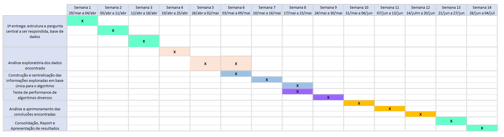

# Estrutura de Aqruivos e Pastas

```
|__ README.md                        <- apresentação do projeto
│__ README_datasets.md               <- informações referentes aos dados utilizados no projeto
|
├── notebooks                        <- Jupyter notebooks
│   |__ NDA
|
└── media                            <- mídias usadas e/ou produzidas no projeto
    |__NDA
```

# Projeto `<Título em Português>`
# Project `<Title in English>`

# Apresentação

| Nome  | RA | Especialização |
| :---: | :-: | :-----------: |
| Andreza Aparecida dos Santos | 164213  | Computação |
| Leonardo Marçal  | 225240 | Computação |
| Lígia Vasconcellos  | 081938 | Estatística |
| Lucas de Oliveira Fujii | 235599 | Saúde |
| Mariana Amaral Raposo  | 262866 | Saúde |

# Descrição Resumida do Projeto

O coronavírus 2019 (COVID-19) é causado por um novo coronavírus conhecido como síndrome respiratória aguda grave coronavírus 2 (SARS-CoV-2). A rápida disseminação desse patógeno e o número crescente de casos e óbitos têm levado vários países ao colapso sanitário, hospitalar e econômico.
O Brasil viveu em março de 2021 o mês mais mortal da pandemia de COVID-19, com 66 mil óbitos registrados e a saturação dos sistemas de saúde públicos e privados. O que destaca a necessidade urgente de medidas efetivas de controle da doença como forma de evitar o avanço descontrolado e a incidência de novos picos.


Estudos de eficácia (ESTUDOS DE EFICÁCIA FIO CRUZ/ANVISA?) confirmam o impacto que a vacinação em massa da população pode trazer na queda nos índices de mortalidade da doença e, consequentemente, reduzindo as taxas de ocupação dos hospitais, enfatizando sua importância. Entretanto, por ser um país de dimensões continentais, cada dia verificamos mais desafios na produção e acesso total da população à vacinação.
Neste sentido e considerando a necessidade iminente de medidas efetivas de minimização da crise sanitária e econômica atual, o presente projeto tem o intuito de analisar parâmetros multidimensionais relacionados ao COVID-19 em cada região do Brasil, buscando por relações nos dados que possam ser capazes de fornecer uma melhor análise estatística das regiões e levantar possíveis planos de vacinação que impactem mais rapidamente no controle da pandemia.


O poder da vacinação em grupos e regiões prioritárias que mais são afetadas pelas crises sanitárias e econômicas poderão auxiliar na redução da taxa de mortalidade e no equilíbrio do sistema de saúde.


# Perguntas de Pesquisa

* De acordo com as taxas de mortalidade e parâmetros multidimensionais correlacionados ao COVID-19, quais regiões e públicos-alvo deveriam ser priorizados na campanha de vacinação visando minimizar o efeito da crise sanitária e econômica.

# Bases de Dados
> Brainstrom -> Dados necessários:
> * informações de mortalidade de covid ()
> * taxa de ocupação de uti ()
> * demandas de leitos de enfermaria e uti()
> * disponibilidade de profissionais da área da saúde ()
> * idade média da população(IBGE)
> * número de trabalhadores informais/informais (IBGE)
> * porcentagem atual de vacinados?
> * contexto sociodemográfico regional(IBGE)
> * temporalidade dos dados()

> links referência:
> * [kaggle_covid_dataset])(https://www.kaggle.com/unanimad/corona-virus-brazil/code)
> * [covid_saude_gov](https://covid.saude.gov.br/)
> * [comitecientifico-ne](https://www.comitecientifico-ne.com.br/c4ne/o-c4ne)
> * [Observatório_covid19](https://portal.fiocruz.br/observatorio-covid-19)
> * [Agencia IBGE](https://agenciadenoticias.ibge.gov.br/agencia-detalhe-de-midia.html?view=mediaibge&catid=2103&id=3702)
> * [OpenDataSUS](https://opendatasus.saude.gov.br/dataset/registro-de-ocupacao-hospitalar/resource/f9391f7c-9775-4fac-a3ce-bf384e2674c2?view_id=04f2877a-2ea0-4b59-b630-5c530d8db3f2)
> * [Our World in Data](https://ourworldindata.org/coronavirus-data)
> * [IBGE] (https://www.ibge.gov.br/estatisticas/downloads-estatisticas.html)

# Metodologia
> (Rascunhos) Este trabalho tem como finalidade a realização de um estudo com o objetivo de compreender a potencial influência da vacinação aplicada prioritariamente a perfis em condições mais propensas a mortalidade, considerando não apenas como critério a idade do indivíduo a ser imunizado. Para isso, inicialmente será realizada uma análise de dados estatística exploratória correlacionando todas as variáveis encontradas provenientes de múltiplas origens de bases de dados. Esta primeira exploração possibilitará identificar relações de causa e efeito e características do meio em que o indivíduo está inserido, tais como PIB, disponibilidade de leitos, médicos, materiais hospitalares, bem como características sociodemográficas: idade, condições de saúde, gênero e etc.
Após a fase inicial em que teremos um panorama da situação do COVID no Brasil, passaremos a estudar o ponto mais específico do estudo: quais são os perfis de indivíduos que deveriam ser priorizados na vacinação? Para tal, construiremos uma base cuja unidade de análise será indivíduos contaminados ou com suspeita de covid e todas as suas características específicas. A esta base será atribuído um target: morte ou não devido ao covid.
Através desta base, serão aplicados múltiplas técnicas de algoritmos supervisionados, tais como regressão logística, random forest, árvore de decisão, SVM e redes neurais. Ao final destes testes de algoritmos, também se fará necessária a aplicação de um método de clusterização para identificação de perfis similares que poderiam ser utilizados como “grupos de prioridade”.

# Ferramentas
> (Rascunhos) Com base na visão atual do grupo sobre o projeto, acreditamos que as ferramentas utilizadas serão o python e algumas bibliotecas consagradas para machine learning e análise de dados: sklearn, tensor flow, pandas e etc.
  Como insumo, utilizaremos múltiplas fontes públicas de informações sobre dados de covid e informações sociodemográficas dos brasileiros.


# Cronograma
> 
