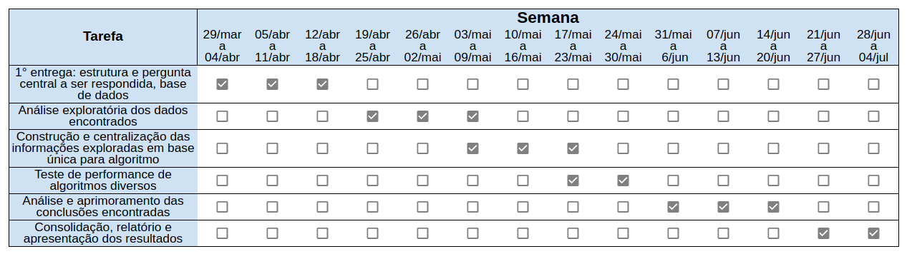

# Estrutura de Arquivos e Pastas

```
|__ README.md                                <- apresentação do projeto
|
|__ data
|   │__ README_datasets.md                   <- informações referentes aos dados utilizados no projeto
|   |__ external
|   |   |__ agencia_ibge_not_resp_med_leito_enf_2019_partial.xlsx
|   |   |__ ibge_trabalhadores informais_2019.xlsx
|   |   |__ esus-vepi.LeitoOcupacao_28_04_2021_partial.csv
|   |
|   |__ interim
|   |   |__ merged_datasets_datasus_ibgenoticias_v5_partial.csv
|   |
|   |__ processed
|       |__ df_final_partial.csv
|
├── notebooks                                <- Jupyter notebooks
│   |__ centralizando_bases.ipynb
|   |__ analise_exploratoria_entrega_2.ipynb
|   |__ analise_centraliza.ipynb
|   |__ Tratamento_Variaveis_E_Treinamentos.ipynb
|
└── assets                                   <- mídias usadas e/ou produzidas no projeto
    |__ pitch.mov                            
    |__ cronograma_v2.png                    
    |__ analise_exploratoria.pdf      
    |__ dicionario_covid_saude_gov.pdf
    |__ apresentacao_projeto.pdf
    |__ apresentacao_final.pdf
    |__ video_final.mov
```

# Projeto `Analisando parâmetros multidimensionais: como direcionar o foco na vacinação prioritária de populações-chave`

# Project `Multi Dimensional parameters analysis: how to direct the focus on priority vaccination of key-population`

# Apresentação

O presente projeto foi originado no contexto das atividades da disciplina de pós-graduação [Ciência e Visualização de Dados em Saúde](https://github.com/datasci4health/home), oferecida no primeiro semestre de 2021, na Unicamp.

| Nome  | RA | Especialização |
| :---: | :-: | :-----------: |
| Andreza Aparecida dos Santos | 164213  | Computação |
| Leonardo Marçal  | 225240 | Computação |
| Lígia Vasconcellos  | 081938 | Estatística |
| Mariana Amaral Raposo  | 262866 | Saúde |

**Neste arquivo apresentamos de forma muito resumida o projeto e seus resultados. Para o texto completo do relatório produzido por esse trabalho, acesse [aqui](./assets/relatorio_final.pdf).**

# Descrição Resumida do Projeto

A rápida disseminação do novo coronavírus (COVID-19) e o número crescente de casos e óbitos destaca a necessidade urgente de medidas efetivas de controle da doença. O impacto da vacinação em massa trouxe queda nos índices de mortalidade da doença e, consequentemente, reduziu as taxas de ocupação dos hospitais, enfatizando sua importância. No Brasil, o esquema de vacinação contra a COVID-19 do Ministério da Saúde iniciou-se com os grupos prioritários definidos como: idosos, povos indígenas, profissionais de saúde e de serviços essenciais. Entretanto,  sendo  o  Brasil  um  país  de  dimensões  continentais  e  detentor  de  grandes diferenças econômicas e populacionais entre suas regiões, a cada dia verificamos mais desafios na produção e acesso total da população à vacinação da COVID-19. Neste sentido e considerando a necessidade iminente de medidas mais efetivas de minimização da crise sanitária e econômica relativa a pandemia da COVID-19, o presente projeto objetivou analisar parâmetros multidimensionais relacionados à COVID-19, quais regiões e públicos-alvo deveriam ser priorizados na campanha de vacinação. O estudo procurou compreender a potencial influência da vacinação aplicada prioritariamente a perfis em condições mais propensas a mortalidade, considerando não apenas como critério a idade do indivíduo a ser imunizado. Levou-se em consideração o contexto pandêmico vivenciado, realizando um parâmetro com o ano de 2019 como forma de buscar por relações nos dados que possam ser capazes de fornecer uma melhor análise estatística das regiões e levantar possíveis planos de vacinação que poderiam beneficiar, de maneira mais ágil, o controle da pandemia de COVID-19. De forma metodológica, utilizamos o modelo KDD –
Knowledge Discovery in Databases (KDD). Inicialmente, foi realizada uma análise de dados estatística exploratória correlacionando variáveis, tais como PIB, disponibilidade de leitos, médicos e materiais hospitalares, bem como características sociodemográficas: idade, condições de saúde, gênero, entre outros.


# Vídeos do Projeto

## Vídeo da Proposta

O video disponível neste [link](./assets/pitch.mov) trás a apresentação da proposta.

## Vídeo da Apresentação Final

O video disponível neste [link](./assets/video_final.mov) trás a apresentação final do projeto.

# Slides do Projeto

## Slides da Proposta

Os slides estão disponíveis neste [link](./assets/apresentacao_projeto.pdf).

## Slides da Apresentação Final

Os slides estão disponíveis neste [link](./assets/apresentacao_final.pdf).

# Introdução e Referências de Teóricos


# Perguntas de Pesquisa

* De acordo com parâmetros multidimensionais correlacionados ao COVID-19, quais regiões e públicos-alvo deveriam ser priorizados na campanha de vacinação visando minimizar o efeito da crise sanitária e econômica?

# Objetivos do Projeto

O presente projeto tem o intuito de analisar parâmetros multidimensionais relacionados à COVID-19 em cada região do Brasil, buscando por relações nos dados que possam ser capazes de fornecer uma melhor análise estatística das regiões e levantar possíveis planos de vacinação que impactem mais rapidamente no controle da pandemia.

# Metodologia

Este trabalho tem como finalidade a realização de um estudo com o objetivo de compreender a potencial influência da vacinação aplicada prioritariamente a perfis em condições mais propensas a mortalidade, considerando não apenas como critério a idade do indivíduo a ser imunizado. Para isso, inicialmente será realizada uma análise de dados estatística exploratória correlacionando todas as variáveis encontradas provenientes de múltiplas origens de bases de dados. Esta primeira exploração possibilitará identificar relações de causa e efeito e características do meio em que o indivíduo está inserido, tais como PIB, disponibilidade de leitos, médicos e materiais hospitalares, bem como características sociodemográficas: idade, condições de saúde, gênero, etc.

Após a fase inicial em que teremos um panorama da situação do COVID no Brasil, passaremos a estudar o ponto mais específico do estudo: quais são os perfis de indivíduos que deveriam ser priorizados na vacinação? Para tal, construiremos uma base cuja unidade de análise será indivíduos contaminados ou com suspeita de covid e todas as suas características específicas. A esta base será atribuído um target: morte ou não devido ao covid.

Através desta base, serão aplicados múltiplas técnicas de algoritmos supervisionados, tais como regressão logística, random forest, árvore de decisão, SVM e redes neurais. Ao final destes testes de algoritmos, também se fará necessária a aplicação de um método de clusterização para identificação de perfis similares que poderiam ser utilizados como “grupos de prioridade”.

## Bases de Dados e Evolução

Com o objetivo de obter uma base com variáveis que permitam a resposta da pergunta principal do projeto, concluiu-se que seria necessária que esta base tenha informações a nível de indivíduo. Isso quer dizer que, para cada indivíduo infectado, precisamos obter informações relavantes quanto ao seus estado de saúde como resultados de exames de sangue e outros exames efetuados, mas também informações macro sobre a região e contexto social as quais estaria inserido. Tendo em mãos estas informações, teoricamente pode-se testar técnicas de clusterização dos indivíduos com características comuns para que depois essas informações sejam utilizadas por algoritmos supervisionados com o objetivo de determinar quais conjuntos de características correspondem a maiores taxas de letalidade dentre os infectados por COVID-19.

### Bases Estudadas mas Não Adotadas

| Base de Dados  | Endereço na Web | Resumo descritivo |
| :------------: | :-------------: | :---------------: |
| 1. owid-covid-data.csv | https://github.com/owid/covid-19-data/tree/master/public/data  | Base com informações sobre o avanço da doença COVID-19 a nível de  país. |
| 2. Coronavirus (COVID-19) - Brazil Dataset | https://www.kaggle.com/unanimad/corona-virus-brazil | Base com informações sobre o avanço da doença COVID-19 a nível de país, estado e cidade.  |

#### 1. OWID Coronavirus-data

Esta base de dados é composta por arquivos que possuem informações referentes a números relacionadas a COVID-19 por país, como números de casos, mortes, recuperados, quantidade de vacinados, dados gerais da população, entre outros (dados desde 26.02.2020 ate 06.04.2021). A base apresenta as seguintes variáveis:

``` iso_code, continent, location, date, weekly_hosp_admissions_per_million, new_cases, new_cases_smoothed, total_deaths, new_deaths, new_deaths_smoothed, total_cases_per_million, new_cases_per_million, new_cases_smoothed_per_million, total_deaths_per_million, new_deaths_per_million, new_deaths_smoothed_per_million, reproduction_rate,icu_patients, icu_patients_per_million, hosp_patients, hosp_patients_per_million, weekly_icu_admissions, weekly_icu_admissions_per_million, weekly_hosp_admissions, total_cases, new_tests, total_tests, total_tests_per_thousand, new_tests_per_thousand, new_tests_smoothed, new_tests_smoothed_per_thousand, positive_rate, tests_per_case, tests_units, total_vaccinations, people_vaccinated, people_fully_vaccinated, new_vaccinations, new_vaccinations_smoothed, people_vaccinated_per_hundred, people_fully_vaccinated_per_hundred, new_vaccinations_smoothed_per_million, stringency_index, population, population_density,  median_age, aged_65_older, aged_70_older, gdp_per_capita, extreme_poverty, cardiovasc_death_rate, diabetes_prevalence, female_smokers, male_smokers, handwashing_facilities, hospital_beds_per_thousand, life_expectancy, human_development_index```

Essa base possui bastante informação relevante para o contexto do estudo proposto, entretanto as informações estão a nível de continente, ou seja, cada variável representa o somatório correspondente a território nacional. Como o objetivo dessa etapa do projeto é encontrar variáveis que possam ser utilizadas em algoritmos supervisionados para tentar determinar perfis de indivíduos que deveriam ser priorizados na atual etapa de vacinação contra COVID-19, concluiu-se que variáveis sobre o avanço da pandemia apresentadas como somatórios acumulativos não seriam úteis para as próximas etapas, uma vez que pretende-se predizer a nível de indivíduo. Portanto, esta base a nível nacional não será utilizada para os fins desse projeto.


#### 2. Coronavirus (COVID-19) - Brazil Dataset

Esta base de dados está organizada em 5 arquivos .csv. Estes arquivos possuem dados organizados como séries temporais (dados acumulativos) e possuem informações referentes aos números de casos, mortes e recuperados da Covid-19 por estado do Brasil. Discriminamos cada arquivo um a seguir:

1. **brazil_cities_coordinates.csv**: este arquivo contém as variáveis `state_code, city_code, city_name, lat, long e capital`. Estas variáveis com dados geográficos foram avaliadas como não necessárias para os fins do trablaho. Portanto este arquivo não será utilizado no projeto.
2. **brazil_covid19.csv**: este arquivo contém as variáveis `data, region, state, cases e deaths`. Nessa base temos as informaçõe de casos e mortes por COVID-19 apresentadas como um somatório por estado. Como explicado anteriormente para a base OWID Coronavirus-data, não é possível utilizar essas variáveis como entrada para os algoritmos supervisionados para realizar predições por indivíduos. Portanto este arquivo não será utilizado no projeto.
3. **brazil_covid19_cities.csv**: este arquivo possui as variáveis `date, state, name, code, cases e deaths`. Nessa base temos as informações apresentadas como um somatório por estado e cidade. Pelo mesmo motivo explicado anteriormente, este arquivo não será utilizado no projeto.
4. **brazil_covid19_macro.csv**: este arquivo possui as variáveis `date, country, week, cases, deaths, recovered e monitoring`. Nessa base temos as informações apresentadas como um somatório do país. Pelo mesmo motivo explicado anteriormente, este arquivo não será utilizado no projeto.
5. **brazil_population_2019.csv**: este arquivo possui as variáveis `region, state, city, state_code, city_code, health_region_code, health_region e population`. Após avaliação desse arquivo, chegamos a conclusão de que a única variável útil para os finsd o projeto seria a `population`, entretanto esse dado já está presente em outra base que será utilizada. Portanto este arquivo não será utilizado no projeto.


### Bases Estudadas e Adotadas

Para as bases adotadas neste projeto, realizamos um centralização dos dados em um único arquivo para que as análises das variáveis em relação a nossa variável de resposta pudesse ser feita de forma mais direta. Foram centralizadas as seguintes bases:

| Base de Dados  | Endereço na Web | Resumo descritivo |
| :------------: | :-------------: | :---------------: |
| 1. INFLUD-05-04-2021.csv | https://covid.saude.gov.br/  | Base com informações por indivíduos contaminados com COVID-19. |
| 2. esus-vepi.LeitoOcupacao_28_04_2021.csv  | https://opendatasus.saude.gov.br/dataset/registro-de-ocupacao-hospitalar/resource/f9391f7c-9775-4fac-a3ce-bf384e2674c2?view_id=04f2877a-2ea0-4b59-b630-5c530d8db3f2 | Base com informações de disponibilidade de leitos de UTI e Clínicos.  |
| 3. agencia_ibge_noticias_.xlsx | https://agenciadenoticias.ibge.gov.br/agencia-detalhe-de-midia.html?view=mediaibge&catid=2103&id=3702 | Base com informações sobre disponibilidade de respiradores, leitos, profissionais médicos e enfermeiros. |
| 4. ibge_PIB_tabelas_completas_2018.xlsx | https://www.ibge.gov.br/estatisticas/downloads-estatisticas.html  | Base com informações de distribuição do PIB pelo território naciaonal. |
| 5. ibge_trabalhadores_informais.xlsx  | https://agenciadenoticias.ibge.gov.br/agencia-noticias/2012-agencia-de-noticias/noticias/25066-pesquisa-revela-retrato-inedito-do-mercado-de-trabalho-do-interior-do-pais | Base com informações sobre quantidade de trabalhadores informais por município e estado. |


#### Integração entre Bases

Devido a nossa enorme quantidade de dados, o processo de integração entre as bases precisou ser feito em duas etapas: (1) integração das bases 2,3,4 e 5, de tamanhos menores em relação a base 1, entre si. (2) integração da base resultante de (2) na base 1.

A primeira integração foi feita utilizando-se como chaves as informações de UF e Município das bases 3, 4 e 5 para gerarmos um arquivo único com todas as informações. Após essa etapa, utilizamos as chaves referentes ao UF, Município e Data de Notificação presentes na base 2 para centralizar todas as variáveis. O código referente a estes dois passos da integração está disponível no jupyter notebook denominado [centraliza_bases.ipynb](./notebooks/centraliza_bases.ipynb). Uma amostraegem da base resultante resultante está presente em [data/interim](./data/interim)

Partimos então, para a integração com a base 1. Tivemos um grande desafio inicial para centralizar estas duas bases, devido ao tamanho e alto custo operacional, que consumiu bastante tempo do projeto em busca de alternativas para processar essa quantidade de dados. Ao final da centralização, também feita através dos dados de UF, Município e Data de Notificação, obtivemos um banco de dados de 1.189.743 linhas e 194 colunas. Para facilitar os futuros processamentos e reduzir o custo de memória, simplificamos os dados redundantes, a exemplo de códigos que representam os municípios, nomes e códigos de hospitais e outros, de modo que ao final permaneceram 159 colunas no banco de dados. Para esse processamento foi utilizado o jupyter notebook denominado [analise_centraliza.ipynb](./notebooks/analise_centraliza.ipynb). Uma amostraegem da base resultante resultante está presente em [data/processed](./data/processed)


#### Análise Exploratória

Devido ao tamanho final da base de dados e da análise exploratória dos dados ser muito extensa, optamos por fornacê-la através deste [arquivo PDF separado](./assets/analise_exploratoria.pdf) disponível no repositório. Esse processamento está documentado no jupyter notebook denominado [analise_exploratoria_entrega_2.ipynb](./notebooks/analise_exploratoria_entrega_2.ipynb)


# Ferramentas

Com base na visão atual do grupo sobre o projeto, acreditamos que as ferramentas utilizadas serão o python e algumas bibliotecas consagradas para machine learning e análise de dados: Sklearn, Pandas e etc. Como insumo, utilizaremos múltiplas fontes públicas de informações sobre dados de covid e informações sociodemográficas dos brasileiros.

# Resultados

## Árvore de Decisão

Para esse algoritmo, obtivemos 66,1% de sensibilidade, uma especificidade de 63,67% e acurácia de 62,75%.

## Floresta Aleatória

Esse algoritmo alcançou uma sensibilidade de 65,21%, uma especificidade de 66,27% e acurácia de 66,79%.

## Floresta Aleatória com Otimização

Esse treinamento conseguiu alcançar uma sensibilidade de 70,69%, especificidade de 62,63% e acurácia de 65,68%.

## Regressão Logística

Assim obtemos as métricas desempenho, com uma especificidade de 57,26%, sensibilidade de 54,65% e acurácia de 65,68%.

# Conclusão

No primeiro experimento realizado utilizando Árvore de Decisão, observou-se que, apesar de não obter o melhor desempenho dentre todos os experimentos, esse algoritmo nos proporcionou uma espécie de classificação para as variáveis, atribuindo uma importância para cada uma dentro do modelo. A partir dela, podemos observar que, além do fator idade, é possível combinar outras informações sobre os indivíduos, como a presença de algum fator de risco, alguns fatores sociais e características do sistema de saúde da região de modo a avaliar o risco do óbito do grupo com aquelas características.

Ao avaliarmos o melhor algorítimo treinado, observamos que a Floresta Aleatória obteve o melhor desempenho com 66,79% de acurácia.

Conduzimos um teste final adicional, com uma amostra de cerca de 200 mil indivíduos. Metade deles faleceu e a outra não mediante a contaminação. Ao aplicar o algoritmo treinado, fizemos a ordenação das probabilidades obtidas para essa amostra da maior para menor probabilidade atribuída.

Ao particionar a base em decis, obtivemos um relevante resultado de ordenação e diferenciação da taxa de letalidade das partes escoradas. Partimos do pressuposto de que, caso o algoritmo não estivesse sendo capaz de ordenar minimamente, todas as partes deveriam ter taxas de letalidade próximas a 50%, que era a média da amostra total. Entretanto, o primeiro decil atingiu uma letalidade 79%, enquanto o ultimo de apenas 10%.

Diante dos resultados, chegamos a conclusão de que, apesar das métricas de resultado dos algoritmos não terem sido tão relevantes quando analisadas sem um contexto e diante da dificuldade e impactos econômicos causados pela demora na vacinação, a priorização vacinal aplicada a grupos de características gerais mais propensas ao óbito e não apenas a faixa de idade poderia ser uma medida eficiente na contingência de consequências desastrosas.

# Trabalhos Futuros

O estudo evidenciou alto potencial de identificação de públicos que reúnem características que representam maior probabilidade de letalidade. Não foi possível estressar todas as hipóteses levantadas, e por isso entende-se que, como próximos passos, há oportunidades para inclusão de outras variáveis e do município, não  contemplada nesta versão devido à indisponibilidade de espaço de memória computacional.
O teste com algoritmos pautados em redes neurais também pode ser pertinente, mediante a vasta multidimensionalidade do conjunto de informações obtidas. Outro ponto que desperta o interesse é a inclusão de casos mais recentes no conjunto de análise, a fim de entender se, após as populações mais idosas terem recebido a vacina, como se comportaram os grupos de indivíduos jovens mas com combinações relevantes de características de risco de letalidade.

# Cronograma


# Referências

* ZHANG, Yanjun et al. Safety, tolerability, and immunogenicity of an inactivated SARS-CoV-2 vaccine in healthy adults aged 18–59 years: a randomised, double-blind, placebo-controlled, phase 1/2 clinical trial. The Lancet Infectious Diseases, [S.L.], v. 21, n. 2, p. 181-192, fev. 2021. Elsevier BV. http://dx.doi.org/10.1016/s1473-3099(20)30843-4
* WU, Zhiwei et al. Safety, tolerability, and immunogenicity of an inactivated SARS-CoV-2 vaccine (CoronaVac) in healthy adults aged 60 years and older: a randomised, double-blind, placebo-controlled, phase 1/2 clinical trial. The Lancet Infectious Diseases, [S.L.], v. [], n. [], p. 1-8, 3 fev. 2021. Elsevier BV. http://dx.doi.org/10.1016/s1473-3099(20)30987-7. Disponível em: https://www.thelancet.com/journals/laninf/article/PIIS1473-3099(20)30987-7/fulltext. Acesso em: 06 abr. 2021.
* Ministério da Saúde, 2021. PLANO NACIONAL DE OPERACIONALIZAÇÃO DA VACINAÇÃO CONTRA A COVID-19. Disponível em: https://www.gov.br/saude/pt-br/media/pdf/2021/janeiro/29/planovacinacaocovid_v2_29jan21_nucom.pdf . Acessado em: 12/04/2021
